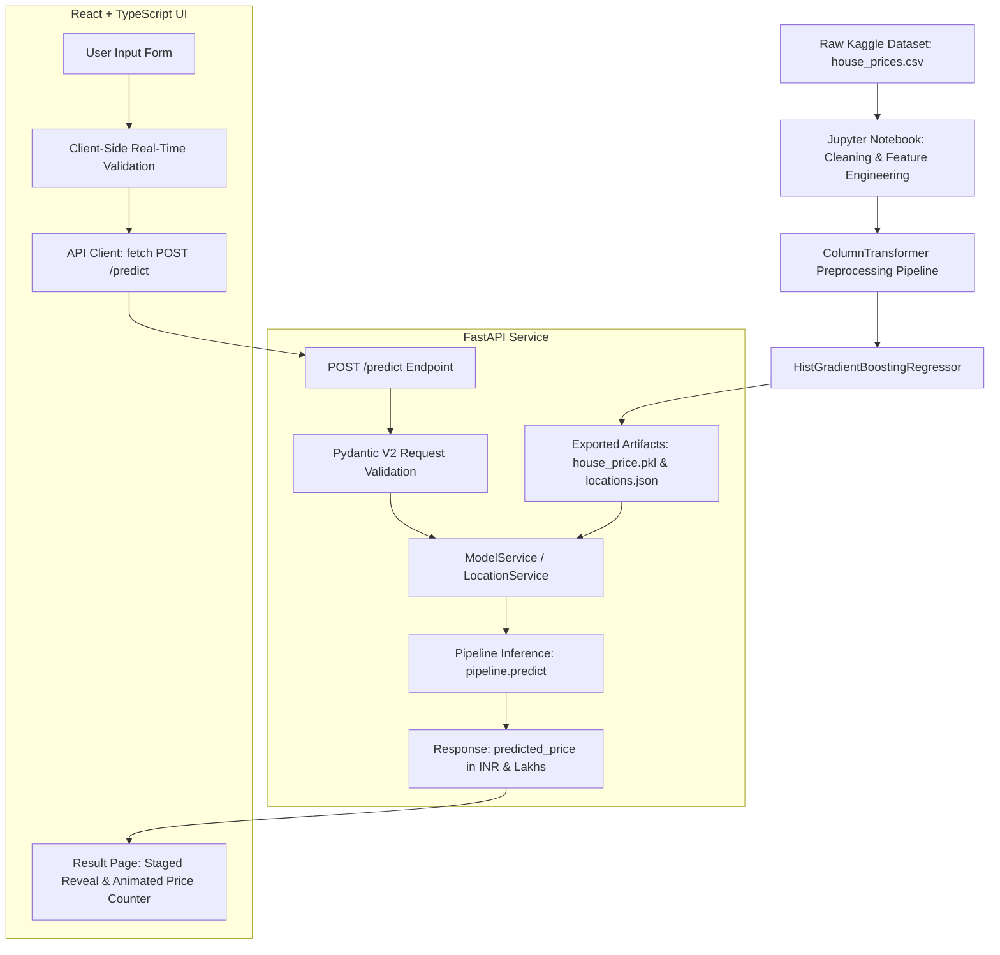

# PropValuate AI — End-to-End Residential Property Valuation

PropValuate AI is a production-oriented, end-to-end machine learning web application that estimates residential property prices across 81 major Indian metropolitan markets and growth corridors. Built upon a validated Scikit-Learn regression pipeline trained on 150,000+ historical property transactions, the system features an asynchronous FastAPI backend and a modern React + TypeScript user interface.

---

## Architecture Overview



---

## What the Application Does

PropValuate AI computes market valuations for residential properties through an automated end-to-end flow:

1. **User Input:** The user provides physical, vertical, and geographic characteristics of a property (Area, BHK, Bathrooms, Balconies, Floor Level, Total Floors, City, Furnishing, Transaction, Facing, Ownership).
2. **Client Validation:** React verifies that all numeric values are positive, room configurations are plausible, and vertical constraints hold (e.g., property floor cannot exceed building stories).
3. **API Dispatch:** The validated request is transmitted as JSON to the FastAPI `/predict` endpoint.
4. **Pydantic Validation & Row Assembly:** FastAPI validates input types and schema constraints, structuring the input into a single-row Pandas DataFrame matching the 11 feature names.
5. **Encapsulated Preprocessing:** The serialized Scikit-Learn `ColumnTransformer` imputes missing values (median for numerics, `'Unknown'` for categoricals), applies `StandardScaler` to numerical inputs, and encodes categoricals via `OneHotEncoder(handle_unknown='ignore')`.
6. **Gradient Boosted Inference:** The trained `HistGradientBoostingRegressor` predicts the target property value (`price_inr`).
7. **Valuation Presentation:** FastAPI returns the valuation in INR and Lakhs. The frontend smoothly transitions to `/result`, performing an animated count-up to the exact valuation alongside localized denomination chips (`₹ Cr` / `₹ Lakhs`) and cost-per-sq-ft analysis.

---

## Machine Learning Model & Contract

### Target Variable: `price_inr`
- **Definition:** The total residential property valuation in Indian Rupees (INR), parsed from raw string expressions (e.g., `"42 Lac"`, `"1.40 Cr"`).
- **Target vs Features:** The target is strictly the continuous prediction label $y$. It is never supplied as an input feature.
- **Data Leakage Purge:** The raw dataset contained a column named `Price (in rupees)`. Investigation revealed this was a calculated unit rate ($\text{Amount} / \text{Area}$) per square foot. Including it would have caused 100% target leakage; it was purged prior to feature extraction.

### Verified Feature Contract (11 Features)
The production pipeline (`house_price.pkl`) expects a DataFrame with the following 11 columns:

```python
NUMERICAL_FEATURES = [
    'area_sqft',     # Float: Carpet/Super area in square feet
    'bhk',           # Float/Int: Bedroom count
    'bathroom',      # Float: Bathroom count
    'balcony',       # Float: Balcony count
    'floor_num',     # Float: Floor number (-1 = Basement, 0 = Ground, 1+ = standard)
    'total_floors'   # Float: Total stories in building
]

CATEGORICAL_FEATURES = [
    'location',      # String: Lowercase city/locality (81 supported cities)
    'Furnishing',    # String: 'Furnished', 'Semi-Furnished', 'Unfurnished'
    'Transaction',   # String: 'Resale', 'New Property', 'Other', 'Rent/Lease'
    'facing',        # String: 'East', 'North', 'North - East', 'West', 'South', etc.
    'Ownership'      # String: 'Freehold', 'Leasehold', 'Co-operative Society', etc.
]
```

---

## Dataset & Preprocessing

- **Source:** Kaggle Indian Housing Price Dataset (`notebooks/data/house_prices.csv`, 187,531 raw listings).
- **Deduplication:** Substantive duplicate removal reduced raw records from 187,531 to 167,485 unique properties.
- **Area Normalization:** Handled multi-unit real-estate area formats (`sqft`, `sqyrd` $\times 9.0$, `sqm` $\times 10.7639$, `acre` $\times 43,560$, `marla` $\times 225.0$) into unified `area_sqft`.
- **Domain Bounds Filtering:** Filtered listings to typical residential ranges ($100 \le \text{area\_sqft} \le 15,000$, $₹2\text{L} \le \text{price\_inr} \le ₹30\text{Cr}$, $1 \le \text{BHK} \le 10$, $1 \le \text{Bathrooms} \le 10$), retaining 151,847 clean samples.
- **Train/Test Split:** 80/20 train/test split with `random_state=42` ($N_{\text{train}} = 121,477$, $N_{\text{test}} = 30,370$).

---

## Feature Dictionary

| Feature | Data Type | Raw Source | Meaning & Role in Valuation |
| :--- | :--- | :--- | :--- |
| `area_sqft` | Numeric (Float) | `Carpet Area`, `Super Area` | Total usable property area in sq ft. Single highest correlated physical driver of price. |
| `bhk` | Numeric (Float) | `Title`, `Description` | Number of bedrooms. Dictates residential capacity and unit scale. |
| `bathroom` | Numeric (Float) | `Bathroom` | Number of bathrooms/toilets. Reflects comfort level and luxury tier. |
| `balcony` | Numeric (Float) | `Balcony` | Number of attached outdoor balconies. Captures premium outdoor space. |
| `floor_num` | Numeric (Float) | `Floor` | Vertical property level (-1: Basement, 0: Ground, 1+: Upper). Captures view/ventilation premiums. |
| `total_floors` | Numeric (Float) | `Floor` | Total building height. Distinguishes builder floors from high-rise societies. |
| `location` | Categorical (String) | `location` | Metropolitan market (81 cities). Captures regional land price baseline. |
| `Furnishing` | Categorical (String) | `Furnishing` | Interior furnishing status (`Furnished`, `Semi-Furnished`, `Unfurnished`). |
| `Transaction` | Categorical (String) | `Transaction` | Sale type (`Resale`, `New Property`, `Other`, `Rent/Lease`). |
| `facing` | Categorical (String) | `facing` | Primary cardinal orientation. Captures cultural Vastu/light preferences. |
| `Ownership` | Categorical (String) | `Ownership` | Legal holding title (`Freehold`, `Leasehold`, `Co-operative Society`, `Power Of Attorney`). |

---

## Floor Logic & Sub-Ground Evidence

- **Property Floor (`floor_num`):** The level on which the residence is located.
- **Total Building Floors (`total_floors`):** The total height of the residential structure.
- **Ground Floor (`floor_num = 0`):** Present in **12,354 raw records** (6.59% of raw dataset) and explicitly supported.
- **Basement Properties (`floor_num = -1`):** Present in **362 raw records** (e.g. `"Upper Basement out of 9"`, `"Lower Basement out of 7"`) and verified in training.
- **Cross-Field Constraint:** An apartment cannot reside on a floor higher than the building height. Both frontend and backend reject requests where $\text{floor\_num} > \text{total\_floors}$ (for standard positive floors).

---

## Technology Stack

- **Machine Learning & Data Science:** Python 3.10+, Scikit-Learn 1.9, Pandas, NumPy, Joblib, Matplotlib, Seaborn.
- **Backend API:** FastAPI 0.115+, Uvicorn 0.30+, Pydantic V2, Pytest, HTTPX.
- **Frontend Client:** React 18, TypeScript 5.6, Vite 6, Tailwind CSS 3.4, React Router 6.28 (with v7 future flags enabled), Lucide React.

---

## Project Structure

```
house-price-project/
├── .gitignore                      # Git exclusion rules (venv, datasets, node_modules)
├── README.md                       # Comprehensive project documentation
├── pytest.ini                      # Pytest configuration with pythonpath root
├── notebooks/
│   ├── data/
│   │   └── house_prices.csv        # Raw dataset (106 MB, ignored by git)
│   └── house_price_model.ipynb     # 54-cell ML notebook (EDA, Cleaning, 4-Model Benchmark, Export)
├── backend/
│   ├── requirements.txt            # Backend Python dependencies
│   ├── .env.example                # Backend environment configuration example
│   ├── models/
│   │   ├── house_price.pkl         # Serialized Scikit-Learn Pipeline artifact (454 KB)
│   │   └── locations.json          # 81 verified city locations metadata
│   ├── app/
│   │   ├── main.py                 # FastAPI application, lifespan startup, CORS, exception handlers
│   │   ├── core/
│   │   │   └── config.py           # Centralized settings and dynamic path resolution
│   │   ├── schemas/
│   │   │   └── prediction.py       # Pydantic request & response contracts
│   │   ├── services/
│   │   │   ├── model_service.py    # Thread-safe ML model inference & lifecycle service
│   │   │   └── location_service.py # Locations metadata loading & lookup service
│   │   ├── api/
│   │   │   └── routes/             # Route handlers: /health, /locations, /predict
│   │   └── utils/
│   │       └── errors.py           # Custom exception definitions & HTTP error handlers
│   └── tests/
│       ├── conftest.py             # TestClient fixtures & service initialization
│       ├── test_health.py          # /health & / endpoint test suite
│       ├── test_locations.py       # /locations endpoint test suite
│       └── test_prediction.py     # /predict validation & inference test suite
└── frontend/
    ├── package.json                # Frontend npm dependencies and scripts
    ├── .env.example                # Frontend environment configuration example
    ├── index.html                  # HTML5 application shell
    ├── tailwind.config.js          # Tailwind CSS design system configuration
    ├── tsconfig.json               # TypeScript configuration
    ├── vite.config.ts              # Vite bundling configuration
    └── src/
        ├── App.tsx                 # Root application with router future flags
        ├── main.tsx                # React DOM root mounting
        ├── index.css               # Design tokens, keyframe animations, reduced-motion rules
        ├── types/                  # TypeScript interface contracts
        ├── api/                    # API client for backend communication
        ├── components/             # Reusable UI components (Form, InputField, SelectField, Header, Footer)
        ├── pages/                  # Route views (HomePage, ResultPage, NotFoundPage)
        └── utils/                  # Formatters and useAnimatedNumber hook
```

---

## Model Evaluation & Benchmark Results

Four candidate regression architectures were benchmarked on the training set using **5-Fold Cross Validation** and evaluated against the held-out test set ($N=30,370$):

| Model Architecture | Test MAE (INR) | Test RMSE (INR) | Test $R^2$ | 5-Fold CV $R^2$ (Mean $\pm$ Std) | Generalization Gap ($R^2_{\text{train}} - R^2_{\text{test}}$) | Artifact Size | Single Inference Latency |
| :--- | :---: | :---: | :---: | :---: | :---: | :---: | :---: |
| Linear Regression | ₹42.11 Lakhs | ₹87.57 Lakhs | 0.5891 | $0.5901 \pm 0.0094$ | 0.0031 | 7.7 KB | 5.5 ms |
| Ridge Regression ($\alpha=10$) | ₹42.03 Lakhs | ₹87.55 Lakhs | 0.5893 | $0.5902 \pm 0.0094$ | 0.0031 | 6.8 KB | 5.4 ms |
| **HistGradientBoosting (Selected)** | **₹28.08 Lakhs** | **₹67.38 Lakhs** | **0.7570** | **$0.7668 \pm 0.0102$** | **0.0877** | **454.5 KB** | **18.9 ms** |
| Random Forest (40 Trees) | ₹28.40 Lakhs | ₹66.39 Lakhs | 0.7640 | $0.7766 \pm 0.0092$ | 0.1732 | 22.1 MB | 53.7 ms |

### Model Selection Rationale
`HistGradientBoostingRegressor` was selected as the production model because:
1. **Strongest Test MAE:** Achieved lowest test mean absolute error (**₹28.08 Lakhs**).
2. **Resistance to Overfitting:** Tight generalization gap (**0.088** vs **0.173** for Random Forest).
3. **Compact Artifact Footprint:** Artifact size of **454.5 KB** (48x smaller than Random Forest at 22.1 MB).
4. **Fast Inference Latency:** Single-sample inference latency of **18.9 ms** (2.8x faster than Random Forest).

---

## Installation & Setup Guide

### 1. Prerequisites
- Python 3.10+ (tested on Python 3.14)
- Node.js 18+ and npm

### 2. Backend Setup
From the project root:

```bash
# 1. Create and activate Python virtual environment
python -m venv .venv
# Windows:
.venv\Scripts\activate
# Linux/macOS:
source .venv/bin/activate

# 2. Install backend dependencies
pip install -r backend/requirements.txt

# 3. Start the FastAPI development server
uvicorn backend.app.main:app --reload --port 8000
```
- API Root: [http://localhost:8000/](http://localhost:8000/)
- Interactive Swagger UI: [http://localhost:8000/docs](http://localhost:8000/docs)
- Interactive ReDoc: [http://localhost:8000/redoc](http://localhost:8000/redoc)

### 3. Frontend Setup
In a separate terminal window:

```bash
# 1. Navigate to the frontend directory
cd frontend

# 2. Install Node dependencies
npm install

# 3. Configure environment variables (optional, defaults to http://localhost:8000)
cp .env.example .env

# 4. Start the Vite development server
npm run dev
```
- Application Web UI: [http://localhost:5173/](http://localhost:5173/)

---

## Environment Variables

### Frontend (`frontend/.env.example`)
| Variable | Default Value | Description |
| :--- | :--- | :--- |
| `VITE_API_BASE_URL` | `http://localhost:8000` | Target URL for FastAPI backend endpoints |

### Backend (`backend/.env.example`)
| Variable | Default Value | Description |
| :--- | :--- | :--- |
| `HOST` | `127.0.0.1` | Local server bind address |
| `PORT` | `8000` | Port for Uvicorn server |
| `CORS_ORIGINS` | `["http://localhost:5173", ...]` | Allowed CORS frontend origins |

---

## API Reference

### 1. Service Health Check (`GET /health`)
```http
GET /health HTTP/1.1
Host: localhost:8000
Accept: application/json
```
**Response (`200 OK`):**
```json
{
  "status": "ok",
  "model_loaded": true,
  "locations_loaded": true,
  "version": "1.0.0"
}
```

### 2. Supported Locations (`GET /locations`)
```http
GET /locations HTTP/1.1
Host: localhost:8000
Accept: application/json
```
**Response (`200 OK`):**
```json
{
  "total_locations": 81,
  "locations": [
    "agra",
    "ahmadnagar",
    "ahmedabad",
    "allahabad",
    "aurangabad",
    "badlapur",
    "bangalore",
    "belgaum",
    "bhiwadi",
    "mumbai",
    "new-delhi"
  ]
}
```

### 3. Predict House Price (`POST /predict`)
```http
POST /predict HTTP/1.1
Host: localhost:8000
Content-Type: application/json

{
  "area_sqft": 1500.0,
  "bhk": 3,
  "bathroom": 2.0,
  "balcony": 2.0,
  "floor_num": 4.0,
  "total_floors": 10.0,
  "location": "bangalore",
  "Furnishing": "Semi-Furnished",
  "Transaction": "Resale",
  "facing": "East",
  "Ownership": "Freehold"
}
```
**Response (`200 OK`):**
```json
{
  "predicted_price": 12465981.21,
  "predicted_price_lakhs": 124.66,
  "currency": "INR",
  "status": "success"
}
```

---

## Automated Testing & Validation

### Running Backend Unit & Integration Tests
The backend test suite verifies endpoint health, locations retrieval, valid predictions, Pydantic validation rejection (HTTP 422), and unseen categorical handling:

```bash
pytest backend/tests -v
```
*Status: 12 passed in 1.71s.*

### Running Frontend Production Build
```bash
cd frontend
npm run build
```
*Status: Built in 2.50s with 0 TypeScript errors.*

---

## Full End-to-End Reproducibility

To reproduce the entire project from scratch:

1. **Obtain Raw Dataset:** Place `house_prices.csv` into `notebooks/data/`.
2. **Execute Notebook:** Run `notebooks/house_price_model.ipynb` from start to finish. This will execute EDA, clean the data, run 5-fold CV across 4 models, and export `backend/models/house_price.pkl` and `backend/models/locations.json`.
3. **Start Backend:** Launch `uvicorn backend.app.main:app --port 8000`.
4. **Start Frontend:** Launch `npm run dev` inside `frontend/`.
5. **Predict:** Open `http://localhost:5173/`, select a city, enter specifications, and view the valuation.

---

## Project Limitations & Disclaimer

- **Informative ML Estimate:** Valuations generated by PropValuate AI are statistical approximations based on historical real-estate transaction patterns.
- **Unmodeled Physical Attributes:** The model does not account for hyper-local micro-factors such as view obstruction, bespoke luxury renovations, building maintenance quality, or seller distress.
- **Not a Certified Appraisal:** This tool is intended for exploratory estimation and does not constitute a certified property appraisal or legally binding financial advice.

---

## Future Roadmap (Not Currently Implemented)

The following architectural enhancements are identified for future phases:
- **Out-of-Distribution (OOD) Confidence Intervals:** Visual warning when inputs exceed historical training percentiles (e.g. area $> 15,000$ sq ft).
- **Model Explainability (SHAP):** Feature attribution waterfall charts highlighting factors that increased or decreased the valuation.
- **Geospatial Mapping:** Interactive map interface showing locality price heatmap and proximity to transit hubs.
- **Historical Property Comparisons:** Comparison module displaying similar historical listings within the same locality.
- **User Accounts & Saved Valuations:** Authentication layer allowing users to save and track property valuation portfolios over time.
