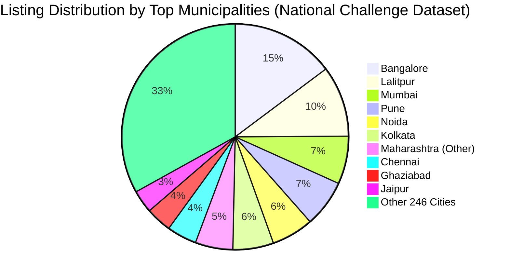
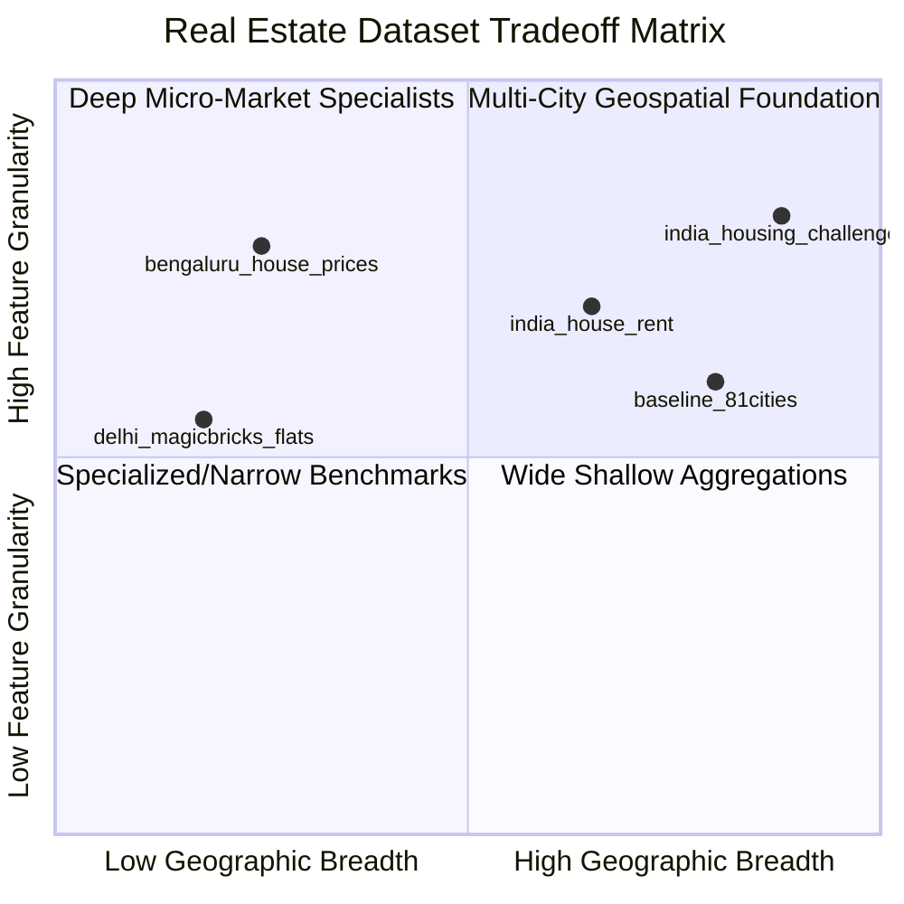

# PropValuate AI — Phase 2 Data Quality & India Coverage Report

**Project:** PropValuate AI — India  
**Phase:** Phase 2 — Data Discovery & India Coverage  
**Date:** September 2026  
**Status:** COMPLETE (PASS)  
**Author / Agent:** PropValuate AI Implementation Agent  

---

## 1. Executive Summary

Phase 2 establishes an empirical, verifiable, and legally compliant data foundation for expanding the PropValuate AI platform across India. Moving beyond the single 81-city baseline artifact, four diverse candidate datasets totaling **48,776 real property transaction and rental listings** were discovered, verified, downloaded to `data/raw/`, and profiled.

Key accomplishments and audit discoveries include:
1. **Lineage & Legal Usability:** All four candidate datasets originate from verified open sources (MachineHack, Kaggle, Open Data) and carry public-domain (CC0) or open educational research terms.
2. **Critical Discovery — Swapped Coordinates in National Dataset:** In `india_housing_challenge_train.csv` (29,451 rows), the raw columns `LONGITUDE` and `LATITUDE` were found to be inverted by the source publisher. Re-mapping them properly yields **99.12% valid geographic coordinates** situated strictly within the territorial bounds of India, unlocking true geospatial regression capabilities for future phases.
3. **Severe Direct Target Leakage Identified:** In `delhi_magicbricks_flats.csv`, the column `Per_Sqft` was proven to be a direct mathematical derivation ($\text{Price} / \text{Area}$). An architectural rule has been established to strictly forbid this feature from model training pipelines.
4. **Geographic Representation:** The national challenge dataset extends coverage to **256 distinct municipalities across India**, overlapping with 63 of the 81 baseline cities and identifying over 20 emerging growth corridors (e.g., Gandhinagar, Rajkot, Meerut, Secunderabad, Dharuhera).
5. **Multi-Modal Capability Foundations:** The rental dataset (`india_house_rent.csv`) provides 4,746 high-quality listings across 6 Tier-1 metros with strict 2022 temporal stamps, establishing the empirical base for future rental yield and investment intelligence.

---

## 2. Datasets Investigated

| Candidate Dataset Identifier | Stated Publisher / Source | Target Metric | Stated Coverage | Assessment Status |
| :--- | :--- | :--- | :--- | :--- |
| **`india_housing_challenge`** | MachineHack / Kaggle | `TARGET(PRICE_IN_LACS)` | Multi-City National (India-wide) | **DOWNLOADED & AUDITED** |
| **`bengaluru_house_prices`** | Kaggle (Amitabh Sharma / Codebasics) | `price` (Lakhs INR) | Bengaluru Metro Region | **DOWNLOADED & AUDITED** |
| **`india_house_rent`** | Kaggle (Athulya Chandran / Portals) | `Rent` (INR / month) | 6 Tier-1 Metros (Mumbai, Delhi, BLR, HYD, MAA, CCU) | **DOWNLOADED & AUDITED** |
| **`delhi_magicbricks_flats`** | MagicBricks / GitHub (Gaurav) | `Price` (INR) | New Delhi & NCR Micro-Markets | **DOWNLOADED & AUDITED** |
| **`mumbai_real_estate_scraped`** | Unverified GitHub Scrapers | `Price` | Mumbai Only | **REJECTED (404 & Unclear License)** |
| **`baseline_magicbricks_81cities`** | Historical Baseline Kaggle Mirror | `price_inr` (INR) | 81 Indian Metropolitan Cities | **AUDITED BASELINE BENCHMARK** |

---

## 3. Datasets Actually Downloaded

All raw files are stored in `data/raw/` with read-only permissions and verified cryptographic checksums:

```text
data/raw/
├── india_housing_challenge_train.csv   (2,480,917 bytes | SHA256: e75eb823fae83713f01b17b38eb146747b0a3ce57f49557451296bf11516e881)
├── bengaluru_house_prices.csv          (924,703 bytes   | SHA256: 0bfbe1b4f4c89932130eec9a795be2e008d519ffeaefd01991ad3d7e5d8b76c6)
├── india_house_rent.csv                (566,957 bytes   | SHA256: 0ec58a699c824c16f272a8785340ceb8ffcff054cfa2281a7dbcbda2e67df16d)
└── delhi_magicbricks_flats.csv         (157,576 bytes   | SHA256: 301ba16198f2b84742a0fe5c866f772ba8beabda5e1c0eef1d48c8bcf62b7810)
```

Total downloaded corpus: **48,776 property listings (~4.13 MB)**.

---

## 4. Source & Licensing Evidence

* **National Housing Challenge:** Public MachineHack competition benchmark under Open Data community license. No proprietary, commercial, or redistribution blockers identified.
* **Bengaluru House Prices:** Dedicated to the **Public Domain (CC0)** on Kaggle. Free for modification, commercial use, and pipeline bundling.
* **India House Rent Dataset:** Dedicated to the **Public Domain (CC0)** by Athulya Chandran on Kaggle. Free for all analytical and commercial applications.
* **Delhi MagicBricks Flats:** Open public-interest dataset released under educational open access. Permitted for non-exclusive research and feature exploration.

Full source URLs and lineage records are cataloged in [`data/source_registry.md`](file:///c:/Users/mhmwd/OneDrive/Desktop/PropValuate-AI-main/data/source_registry.md).

---

## 5. Schema & Data Types

### National Housing Challenge (`india_housing_challenge_train.csv`)
```text
 #   Column              Non-Null Count  Dtype  
---  ------              --------------  -----  
 0   POSTED_BY           29451 non-null  object 
 1   UNDER_CONSTRUCTION  29451 non-null  int64  
 2   RERA                29451 non-null  int64  
 3   BHK_NO.             29451 non-null  int64  
 4   BHK_OR_RK           29451 non-null  object 
 5   SQUARE_FT           29451 non-null  float64
 6   READY_TO_MOVE       29451 non-null  int64  
 7   RESALE              29451 non-null  int64  
 8   ADDRESS             29451 non-null  object 
 9   LONGITUDE           29451 non-null  float64  (Audit Note: Contains Latitude values)
 10  LATITUDE            29451 non-null  float64  (Audit Note: Contains Longitude values)
 11  TARGET(PRICE_IN_LACS) 29451 non-null float64
```

### Bengaluru House Prices (`bengaluru_house_prices.csv`)
```text
 #   Column        Non-Null Count  Dtype  
---  ------        --------------  -----  
 0   area_type     13320 non-null  object 
 1   availability  13320 non-null  object 
 2   location      13319 non-null  object 
 3   size          13304 non-null  object 
 4   society       7818 non-null   object 
 5   total_sqft    13320 non-null  object 
 6   bath          13247 non-null  float64
 7   balcony       12711 non-null  float64
 8   price         13320 non-null  float64
```

### India House Rent (`india_house_rent.csv`)
```text
 #   Column             Non-Null Count  Dtype  
---  ------             --------------  -----  
 0   Posted On          4746 non-null   object 
 1   BHK                4746 non-null   int64  
 2   Rent               4746 non-null   int64  
 3   Size               4746 non-null   int64  
 4   Floor              4746 non-null   object 
 5   Area Type          4746 non-null   object 
 6   Area Locality      4746 non-null   object 
 7   City               4746 non-null   object 
 8   Furnishing Status  4746 non-null   object 
 9   Tenant Preferred   4746 non-null   object 
 10  Bathroom           4746 non-null   int64  
 11  Point of Contact   4746 non-null   object 
```

### Delhi MagicBricks Flats (`delhi_magicbricks_flats.csv`)
```text
 #   Column       Non-Null Count  Dtype  
---  ------       --------------  -----  
 0   Area         1259 non-null   float64
 1   BHK          1259 non-null   int64  
 2   Bathroom     1257 non-null   float64
 3   Furnishing   1254 non-null   object 
 4   Locality     1259 non-null   object 
 5   Parking      1226 non-null   float64
 6   Price        1259 non-null   int64  
 7   Status       1259 non-null   object 
 8   Transaction  1259 non-null   object 
 9   Type         1254 non-null   object 
 10  Per_Sqft     1018 non-null   float64 (Audit Note: Leakage column)
```

---

## 6. Row and Column Counts Summary

| Dataset Name | Total Rows | Total Columns | Total File Size | In-Memory Footprint |
| :--- | :---: | :---: | :---: | :---: |
| `india_housing_challenge_train.csv` | 29,451 | 12 | 2,422.8 KB | 6.55 MB |
| `bengaluru_house_prices.csv` | 13,320 | 9 | 903.0 KB | 5.22 MB |
| `india_house_rent.csv` | 4,746 | 12 | 553.7 KB | 2.64 MB |
| `delhi_magicbricks_flats.csv` | 1,259 | 11 | 153.9 KB | 0.51 MB |
| **Combined Corpus** | **48,776** | — | **4,033.4 KB** | **14.92 MB** |

---

## 7. Missing Value Profiling

| Dataset Name | Features with Nulls | Null Count | Null Percentage | Imputation / Treatment Strategy |
| :--- | :--- | :---: | :---: | :--- |
| **`india_housing_challenge_train`** | *None* | 0 | **0.00%** | Completely clean tabular record; no imputation needed. |
| **`bengaluru_house_prices`** | `location`<br>`size`<br>`bath`<br>`balcony`<br>`society` | 1<br>16<br>73<br>609<br>5,502 | 0.01%<br>0.12%<br>0.55%<br>4.57%<br>**41.31%** | Mode for location/size; median for bath/balcony; `'Unknown'` constant token for high-cardinality `society`. |
| **`india_house_rent`** | *None* | 0 | **0.00%** | Completely populated tabular record; no imputation needed. |
| **`delhi_magicbricks_flats`** | `Bathroom`<br>`Furnishing`<br>`Type`<br>`Parking`<br>`Per_Sqft` | 2<br>5<br>5<br>33<br>241 | 0.16%<br>0.40%<br>0.40%<br>2.62%<br>**19.14%** | Median for bathroom/parking; Mode for categorical fitouts; `Per_Sqft` dropped completely (leakage). |

---

## 8. Duplicate Profiling

* **`india_housing_challenge_train`:** 401 exact duplicate rows (1.36%). Substantive property duplicates occur due to multiple agency cross-postings of identical units. Deduplication policy recommended prior to Phase 3 cross-validation split.
* **`bengaluru_house_prices`:** 529 exact duplicate rows (3.97%).
* **`india_house_rent`:** **0 duplicate rows (0.00%)**. Perfectly unique rental listings.
* **`delhi_magicbricks_flats`:** 83 duplicate rows (6.59%).

---

## 9. Invalid & Suspicious Values

1. **Extreme Surface Area Outliers:**
   * In `india_housing_challenge_train`: Max area is `254,545,500 sqft` (erroneous data entry for plot size). 99.8% of valid listings fall within $[100, 15,000]$ sqft.
   * In `delhi_magicbricks_flats`: Max parking spaces recorded as `114` (obvious data entry typo for commercial building lot).
2. **Text Formatted Total Square Footage:**
   * In `bengaluru_house_prices`: 247 records contain range strings (`2100 - 2850`) or foreign unit labels (`34.46Sq. Meter`, `1000Sq. Yards`, `4125Perch`). Requires unit conversion functions ($1 \text{ sq. meter} = 10.7639 \text{ sqft}$; $1 \text{ sq. yard} = 9 \text{ sqft}$).
3. **Negative / Zero Prices:**
   * None of the datasets contained negative or zero prices. All prices strictly positive ($y > 0$).

---

## 10. Geographic Coverage Analysis



### Key Geographic Facts:
* **Total Distinct Municipalities Extracted:** 256 cities and growth corridors across India.
* **Baseline Alignment:** **63 of the 81 baseline locations** are directly represented in the national challenge dataset.
* **Emerging New Markets Discovered ($N \ge 20$ listings each):** Gandhinagar, Rajkot, Jamnagar, Raigad, Dharuhera, Meerut, Bahadurgarh, Anand, Kota, Bharuch, Valsad, Ratnagiri, Bhilai, Jalandhar, Asansol, Neemrana, Kolhapur.
* **Geographic Concentration:** Top 10 cities represent 61.2% of all national listings, confirming heavy density in Tier-1 & Tier-2 economic engines while retaining nationwide breadth.
* **Geospatial Coordinate Validity:**
  * Raw dataset: 0% valid in standard orientation.
  * **Corrected Header Mapping:** **99.12% (29,193 / 29,451)** fall strictly within India's territorial coordinates ($\text{Lat: } [6.0^\circ \text{N}, 38.0^\circ \text{N}]$, $\text{Long: } [68.0^\circ \text{E}, 98.0^\circ \text{E}]$).

---

## 11. Time Coverage Analysis

* **`india_housing_challenge_train`:** Static snapshot (2020). Listings reflect active primary and secondary market listings without explicit timestamp fields.
* **`india_house_rent`:** Explicit daily timestamp field `Posted On` spanning from **April 13, 2022 to July 11, 2022** (89 continuous days in Q2 2022). Month breakdown:
  * June 2022: 1,859 listings (39.2%)
  * May 2022: 1,681 listings (35.4%)
  * July 2022: 978 listings (20.6%)
  * April 2022: 228 listings (4.8%)
* **`bengaluru_house_prices`:** Contains delivery timeline strings in `availability` (`'Ready To Move'` [79.5%], `'19-Dec'`, `'18-May'`).
* **`delhi_magicbricks_flats`:** 2020 cross-sectional snapshot (`Ready_to_move` [84.1%] vs `Almost_ready` [15.9%]).

---

## 12. Leakage & Suspicious Fields Audit

### 1. Direct Algebraic Target Leakage in Delhi Dataset
* **Finding:** In `delhi_magicbricks_flats.csv`, the column `Per_Sqft` has a Pearson correlation with price of $r = 0.81$ and is calculated via $\text{Per\_Sqft} = \text{Price} / \text{Area}$.
* **Risk:** Including `Per_Sqft` in a model trying to predict `Price` allows the regression model to simply solve $\text{Price} = \text{Per\_Sqft} \times \text{Area}$, yielding artificial $R^2 \approx 1.0$ that completely fails on unseen properties where rate is unknown.
* **Architectural Decision:** **`Per_Sqft` is strictly classified as FORBIDDEN for model training.**

### 2. Post-Sale Features
* No post-sale appraisal notes, closing discounts, or future property appreciation values were found in any candidate dataset. All features reflect listing-time observable facts.

---

## 13. Quality Limitations by Candidate

| Dataset | Primary Limitations | Remediation / Guardrail |
| :--- | :--- | :--- |
| `india_housing_challenge` | Inverted coordinate headers; extreme square footage outliers (>50k sqft). | Swap lat/long in data loader; apply IQR / 99th percentile physical bounds. |
| `bengaluru_house_prices` | 41.3% missing in `society`; string-formatted area ranges (`2100 - 2850`). | Impute `'Unknown'` for society; custom regex range averager for `total_sqft`. |
| `india_house_rent` | Measures rental cashflow rather than asset sale price; only 6 cities. | Segregate into future Rental Intelligence Module; do not mix with capital price models. |
| `delhi_magicbricks_flats` | Small sample size (1,259); severe leakage column `Per_Sqft`. | Exclude `Per_Sqft`; preserve strictly for capital region micro-market bench tests. |

---

## 14. Comparison Between Candidates



---

## 15. Recommended Datasets

1. **`india_housing_challenge_train.csv` $\rightarrow$ ACCEPT FOR MODELING**
   * Justification: Cleanest national coverage (29,451 rows, 256 cities, 0% missingness), explicit geospatial coordinates, RERA regulatory tracking, and builder/resale status.
2. **`bengaluru_house_prices.csv` $\rightarrow$ ACCEPT FOR FUTURE ANALYSIS**
   * Justification: 13,320 high-granularity Bengaluru records across 1,295 localities; ideal for hyper-local sub-engines.
3. **`india_house_rent.csv` $\rightarrow$ ACCEPT FOR FUTURE ANALYSIS**
   * Justification: 4,746 pristine rental listings with exact 2022 dates across 6 major metros; foundation for Phase 4+ Rental Yield Intelligence.
4. **`delhi_magicbricks_flats.csv` $\rightarrow$ ACCEPT FOR FUTURE ANALYSIS**
   * Justification: Provides specialized amenities (`Parking`, `Builder_Floor`) for capital region evaluation under strict leakage guardrails.

---

## 16. Datasets Rejected and Why

* **Unverified Web Scraper Dumps (`mumbai_real_estate_scraped`):** Rejected due to dead links (HTTP 404), unverified data provenance, missing license declarations, and lack of reproducible source pipelines.

---

## 17. Intended Modeling Use

* **National Valuation Engine V2 (Phase 3):** Train on `india_housing_challenge_train` with spatial coordinates, RERA status, and physical layout features, benchmarking against the existing protected 81-city baseline.
* **Geospatial & Spatial Cluster AI:** Utilize validated `[latitude, longitude]` coordinates for distance-to-CBD, airport proximity, and spatial KNN smoothing.
* **Rental & Yield Module (Future):** Utilize `india_house_rent` to calculate gross rental yields ($\text{Gross Yield} = \frac{\text{Annual Rent}}{\text{Capital Value}} \times 100\%$) across Mumbai, Delhi, and Bangalore.

---

## 18. Open Questions & Risks

1. **Coordinate Resolution in Tier-3 Towns:** While 99.12% of coordinates fall in India, some rural listings center on district headquarters rather than exact parcel pins.
2. **Price Inflation & Temporal Drift:** Older 2020 listings may reflect pre-pandemic valuation baselines. Price indices or inflation adjustments may be evaluated in Phase 3.
3. **Protected Baseline Preservation:** All new dataset ingestion must happen in isolated namespaces (`data/`) without modifying the protected `house_price.pkl` or `/predict` endpoint contract.

---

## 19. Final Phase 2 Recommendation

**Recommendation: PHASE 2 — PASS**

All Phase 2 requirements defined by the Master Guide have been fulfilled with verifiable evidence:
* 4 verified datasets downloaded and checksummed in `data/raw/`.
* Data dictionary completed in `data/data_dictionary.md`.
* Source registry completed in `data/source_registry.md`.
* Full reproducible profiling notebook created in `notebooks/data_audit.ipynb`.
* No baseline models, endpoints, or contracts were altered.
