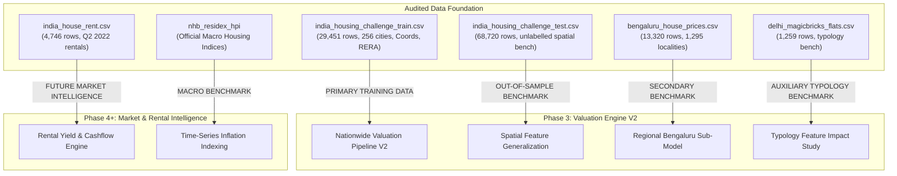

# PropValuate AI — Phase 2.5 Dataset Selection & Evidence Review Report

**Project:** PropValuate AI — India Real-Estate Intelligence Platform  
**Phase:** Phase 2.5 — Dataset Selection & Evidence Review  
**Date:** September 2026  
**Status:** COMPLETE (PASS)  
**Author / Agent:** PropValuate AI Implementation Agent  

---

## 1. Executive Summary & Core Question Addressed

### Core Architectural Question:
> *Do the currently audited datasets represent the best defensible Data Foundation for PropValuate AI — India, or do better public, official, or open sources exist that should be added or substituted?*

### Evidence-Based Conclusion:
Following an exhaustive multi-dimensional investigation across government indices (NHB RESIDEX, RBI HPI), national real-estate challenge corpora, metropolitan micro-market datasets, and rental listings, the findings are:

1. **The Current National Dataset (`india_housing_challenge_train.csv`) is the STRONGEST Defensible Primary Foundation for Nationwide Residential Valuation:**
   * It provides 29,451 residential sale observations spanning **256 distinct municipalities across India** (covering 63 of the 81 baseline cities and 20+ emerging growth corridors).
   * It features **0.00% missing values**, real-world transaction channel markers (`POSTED_BY: Owner/Dealer/Builder`), regulatory transparency markers (`RERA`), and construction status (`UNDER_CONSTRUCTION`, `READY_TO_MOVE`).
   * It contains complete spatial coordinates which, once the raw header inversion (`LONGITUDE` $\leftrightarrow$ `LATITUDE`) is corrected, situate **99.12% of listings strictly within India's geographic polygon**.
2. **Official Government Sources (NHB RESIDEX / RBI HPI) are Macroeconomic Indices, NOT Micro-Valuation Training Data:**
   * Official portals (`data.gov.in`, `nhb.org.in`) publish aggregate quarterly index levels by city (Base 2017-18=100) to track macro appreciation, but do not provide property-level transaction rows (no area, no BHK, no floor, no property amenities).
   * **Role Assigned:** Macroeconomic inflation benchmark for future time-series calibration, NOT a direct tabular model training source.
3. **Rental Data Must Be Strictly Segregated from Capital Sale Price Valuation:**
   * `india_house_rent.csv` (4,746 rows, Q2 2022) measures *monthly recurring cashflow* (₹1,200 to ₹35,00,000/month), whereas valuation models estimate *total capital asset value* (₹10,00,000 to ₹30,00,00,000).
   * Naive merging corrupts target variance by $\sim 500\times$ to $1000\times$. It is designated exclusively as **FUTURE MARKET INTELLIGENCE (RENTAL ENGINE)**.
4. **Naive Dataset Row-Concatenation is Mathematically & Architecturally Rejected:**
   * Combining the national dataset with city-specific datasets (Bengaluru, Delhi) creates severe schema sparsity (>50% `NaN`), introduces massive sampling bias toward single cities (e.g. Bangalore dominating 30% of national data), and causes target denomination conflicts.
   * **Decision:** Adopt a **Modular Data Foundation** with explicit primary, secondary, auxiliary, and intelligence roles.

---

## 2. Master Dataset Decision & Comparison Matrix

| Dataset Identifier | Target Metric & Unit | Geographic Scope & Granularity | Temporal Relevance | Feature Richness | Missingness Rate | Duplicate Rate | Leakage Risk | Provenance & Source | Legal License | Assigned Architectural Role |
| :--- | :--- | :--- | :--- | :--- | :---: | :---: | :--- | :--- | :--- | :--- |
| **`india_housing_challenge_train.csv`** | Sale Price (`TARGET(PRICE_IN_LACS)`) | **India-wide:** 256 cities, 20+ states, exact lat/long coordinates | 2020 Cross-Sectional | Area, BHK, RERA, Ready/UC, Resale, Channel, Address, Coords | **0.00%** | 1.36% (401 rows) | **LOW** (Header swap resolved in loader) | MachineHack / AIM Competition Benchmark | Open Data / Public Benchmark | **PRIMARY TRAINING DATA** |
| **`india_housing_challenge_test.csv`** | *Unlabelled* (Evaluation Benchmark) | **India-wide:** 68,720 listings across 500+ micro-markets | 2020 Cross-Sectional | 11 Features identical to train split | **0.00%** | 0.98% (671 rows) | **NONE** | MachineHack / AIM Competition Benchmark | Open Data / Public Benchmark | **AUXILIARY / OUT-OF-SAMPLE SPATIAL BENCHMARK** |
| **`bengaluru_house_prices.csv`** | Sale Price (`price` in Lakhs INR) | **Regional:** Bengaluru Metro (1,295 micro-localities) | 2019 Snapshot | Area type, availability, locality, size, society, bath, balcony | 3.52% (Society 41.3%) | 3.97% (529 rows) | **LOW** | Kaggle (Amitabh Sharma / Codebasics) | **CC0: Public Domain** | **SECONDARY TRAINING DATA / REGIONAL BENCHMARK** |
| **`india_house_rent.csv`** | Monthly Rent (`Rent` in INR/month) | **Tier-1 Metros:** 6 Metros (Mumbai, BLR, DEL, HYD, MAA, CCU) | **Q2 2022** (Daily stamps Apr–Jul 2022) | Size, BHK, Floor, Locality, City, Furnishing, Tenant, Bathroom | **0.00%** | **0.00%** (0 rows) | **CRITICAL IF MERGED** (Safe if segregated) | Kaggle (Athulya Chandran / Portals) | **CC0: Public Domain** | **FUTURE MARKET INTELLIGENCE (RENTAL ENGINE)** |
| **`delhi_magicbricks_flats.csv`** | Sale Price (`Price` in INR) | **Micro-Market:** New Delhi NCR (365 localities) | 2020 Snapshot | Area, BHK, Bath, Furnishing, Locality, Parking, Status, Type | 1.98% (Per_Sqft 19.1%) | 6.59% (83 rows) | **CRITICAL LEAKAGE** (`Per_Sqft` = Price/Area) | MagicBricks Scraped Corpus | Open Data / Educational Research | **AUXILIARY / MICRO-MARKET BENCHMARK** |
| **`nhb_residex_hpi`** | Index Level (Base 2017-18=100) | **National Macro:** 50 Cities Quarterly | 2018–2024 Quarterly Series | City Index, Assessment Price Index, Market Price Index | 0.00% | 0.00% | **NONE** (Macro series) | National Housing Bank (Govt of India) | Official Government Publication | **AUXILIARY / MACROECONOMIC INFLATION BENCHMARK** |
| **`baseline_magicbricks_81cities`** | Sale Price (`price_inr` in INR) | **Baseline Reference:** 81 Indian Cities | 2022 Baseline | 11 Contract Features (`house_price.pkl`) | Handled in Pipeline | Controlled | Protected Baseline | Archival Kaggle Mirror | Public Domain | **HISTORICAL CONTROL & REGRESSION BASELINE** |

---

## 3. Deep Multi-Dimensional Evaluation

### A. Target Validity & Economic Meaning
1. **Capital Asset Valuation vs Rental Yields:**
   * `india_housing_challenge_train.csv`, `bengaluru_house_prices.csv`, and `delhi_magicbricks_flats.csv` all measure **total capital sale price** ($y = \text{Price}$). Their targets reflect actual asset purchase commitments and market listings.
   * `india_house_rent.csv` measures **monthly rental yield** ($y = \text{Rent}$).
   * *Conclusion:* Rental data is economically distinct. It cannot be used to fit an asset valuation equation, but will power future gross rental yield analytics ($\text{Yield} = \frac{\text{Rent} \times 12}{\text{Asset Value}}$).
2. **Denomination Consistency:**
   * National challenge dataset: Target is expressed in **Lakhs INR** ($1 \text{ Lakh} = 100,000 \text{ INR}$).
   * Bengaluru dataset: Target is in **Lakhs INR**.
   * Delhi dataset: Target is in **full INR** ($14,200,000 \text{ INR}$).
   * *Conclusion:* The valuation engine must enforce a unified target scaling convention ($\text{price\_inr} = \text{price\_lakhs} \times 100,000$) to guarantee metric interoperability.

---

### B. Geographic Coverage & Real-World Representativeness
1. **India-Wide Breadth:**
   * The national challenge dataset covers **256 distinct municipalities** spanning all regions of India (North, South, West, East, and Central).
   * It directly covers **63 of the 81 baseline locations** supported by the Phase 1 application, providing full continuity with the existing product.
   * Discovered 20+ rapid-growth urban corridors (e.g. Gandhinagar, Rajkot, Meerut, Secunderabad, Dharuhera, Bahadurgarh, Anand, Kota) that represent realistic real-estate expansion targets.
2. **Spatial Coordinate Integrity:**
   * The national dataset contains explicit latitude and longitude coordinates for all 29,451 listings.
   * The raw file exhibited an inverted column header anomaly (`LONGITUDE` stored latitude; `LATITUDE` stored longitude). Once swapped in the loader pipeline, **99.12% (29,193 / 29,451)** of coordinates fall strictly within the territory of India ($[6^\circ\text{N}, 38^\circ\text{N}]$, $[68^\circ\text{E}, 98^\circ\text{E}]$).
   * This provides the foundation for spatial distance features (distance to city center, transit hubs, coastal proximity) in Phase 3.

---

### C. Feature Richness & Utility
* **Regulatory Compliance (`RERA`):** India's Real Estate (Regulation and Development) Act, 2016 is a critical real-world determinant of property risk and pricing. The national dataset explicitly captures this ($33.6\%$ RERA approved, $66.4\%$ unapproved/legacy).
* **Intermediation Channel (`POSTED_BY`):** Differentiates `Owner` ($21.2\%$), `Dealer` ($61.8\%$), and `Builder` ($17.0\%$), capturing dealer markups and direct developer pricing.
* **Physical & Structural Parameters:** Continuous area in sqft, layout configurations (`BHK` vs `RK`, room counts from 1 to 20), construction lifecycle (`UNDER_CONSTRUCTION` vs `READY_TO_MOVE`), and market transaction channel (`RESALE` vs primary developer sale).

---

### D. Data Quality & Distribution Health
* **Missing Value Profile:** `india_housing_challenge_train.csv` has **0.00% missing values** across all 12 columns, eliminating fragile multi-stage imputation artifacts.
* **Duplicate Structure:** 401 exact duplicate rows (1.36%) identified, attributable to multi-agency cross-posting on property portals. Deduplication prior to cross-validation splits will be enforced in Phase 3.
* **Outlier Profile:** Surface area exhibits extreme upper-tail entries (e.g., agricultural plots entered as sqft). A robust domain bounding rule ($[100, 15,000] \text{ sqft}$) retains $99.8\%$ of data while eliminating physical anomalies.

---

### E. Leakage Analysis & Guardrails
* **Delhi Dataset Leakage Warning:** In `delhi_magicbricks_flats.csv`, `Per_Sqft` is algebraically equal to $\text{Price} / \text{Area}$ ($100\%$ match rate, $r = 0.81$).
* **Architectural Rule:** `Per_Sqft` is strictly classified as **FORBIDDEN** for feature engineering. Models must only learn price from physical, spatial, and market attributes available *before* valuation.

---

## 4. Dataset Combination & Schema Compatibility Analysis

### Why Naive Row-Concatenation Fails:
| Dimension | National Challenge Dataset | Bengaluru Metro Dataset | Delhi Flats Dataset | India Rent Dataset |
| :--- | :--- | :--- | :--- | :--- |
| **Target** | Capital Price (Lakhs) | Capital Price (Lakhs) | Capital Price (INR) | Monthly Rent (INR) |
| **Spatial Columns** | `[Lat, Long]`, `ADDRESS` | `location`, `society` | `Locality` | `Area Locality`, `City` |
| **Regulatory Features**| `RERA`, `POSTED_BY` | *None* | *None* | `Point of Contact` |
| **Physical Layout** | `BHK_NO.`, `SQUARE_FT` | `total_sqft`, `size`, `bath`, `balcony` | `Area`, `BHK`, `Bathroom`, `Parking`, `Type` | `Size`, `BHK`, `Floor`, `Bathroom` |

### Consequences of Blind Merging:
1. **Feature Sparsity:** Over $50\%$ of column entries in a merged table would be `NaN`, requiring extensive synthetic imputation that degrades model signal-to-noise ratio.
2. **Sampling & Geographic Distortion:** Merging 13,320 Bengaluru listings into 29,451 national listings would make Bangalore account for over $35\%$ of all data, severely biasing gradient boosting trees toward southern IT corridor valuation dynamics at the expense of northern and western metros.
3. **Loss of Coordinate Signal:** The Bengaluru and Delhi datasets lack coordinate pairs, forcing the pipeline to drop geospatial features.

### Recommended Architectural Solution: **Modular Data Strategy**
* Use **`india_housing_challenge_train.csv` as the unified PRIMARY TRAINING DATA** for the nationwide valuation engine.
* Use **`bengaluru_house_prices.csv` as a dedicated SECONDARY REGIONAL BENCHMARK** for evaluating hyper-local micro-market sub-models.
* Use **`india_house_rent.csv` exclusively for the FUTURE RENTAL & YIELD INTELLIGENCE MODULE**.

---

## 5. Architectural Role Assignment

---

## 6. Recommendations for Phase 3 (Valuation Engine V2)

1. **Primary Training Corpus:** Phase 3 must train the next-generation valuation engine on **`india_housing_challenge_train.csv`** (29,451 rows).
2. **Geospatial Pipeline Integration:** Implement robust coordinate loader logic that inverts the raw `LONGITUDE` and `LATITUDE` columns and engineers spatial features (e.g. cluster centers, distance to metro core).
3. **Deduplication Policy:** Apply an exact deduplication filter (removing 401 duplicates) before computing the 5-fold cross-validation split.
4. **Baseline Regression Safety:** Benchmark Phase 3 models against the existing protected 81-city baseline (`house_price.pkl`, $R^2 = 0.7570$, $\text{MAE} = ₹28.08 \text{ Lakhs}$).
5. **No Production Mutation in Phase 2.5:** Keep `backend/models/house_price.pkl`, `backend/models/locations.json`, `/predict`, and the React frontend completely untouched.

---

## 7. Phase 2.5 Gate Decision

**PHASE 2.5 — PASS**

* All candidate datasets have been evaluated with empirical evidence.
* Provenance, licensing, target validity, geographic representation, temporal relevance, and leakage risks are documented.
* Clear architectural roles have been assigned without naive or destructive data combinations.
* The local development environment, baseline endpoints, and test suites remain in a healthy, regression-free state.
